# Atmega fusebit doctor (HVPP+HVSP) – fix the fusebits  
"cloned" from here http://mdiy.pl/atmega-fusebit-doctor-hvpp/?lang=en  
(https://web.archive.org/web/20180225102717/http://mdiy.pl/atmega-fusebit-doctor-hvpp/?lang=en)  
  
-----
  

<a href="pics/mega_fusebit_doctor_1.jpg">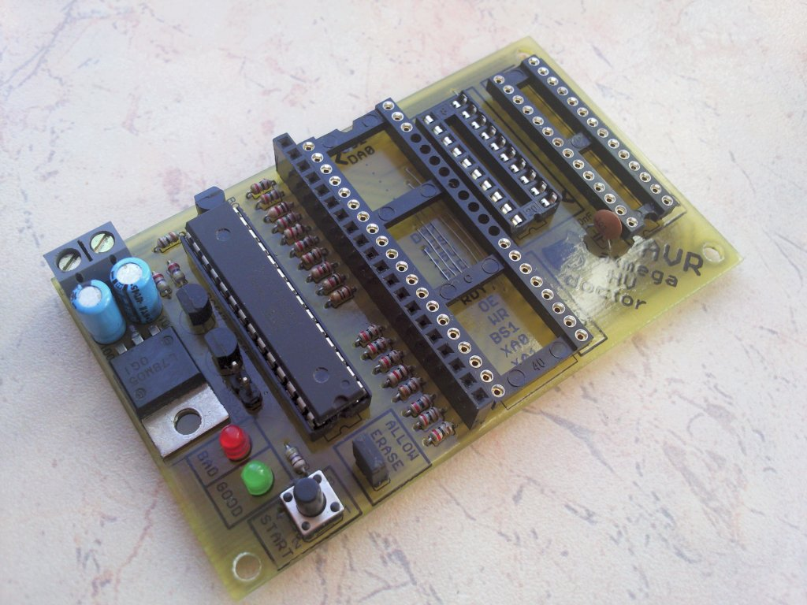</a>Atmega fusebit doctor, as name says it, device for repairing dead Atmega (and Attiny from v2.04) family AVRs by writing correct fusebits. Most common mistakes or problems are a wrong clock source (CKSEL fusebits), disabled SPI programming (SPIEN fuse) or disabled reset pin (RSTDISBL fuse). This simple and cheap circuit will fix you uC in a fraction of a second. If in first case we can help ourself with clock generator, then in 2nd and 3rd cases bring uC back to life is impossible with standard serial programmer. Most of people do not decide to build parallel programmer because its inconvenient and its cheaper and faster to buy new uC.

 

<h3>High voltage programming</h3>

<a href="pics/mega_fusebit_doctor_3.jpg">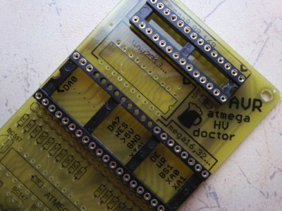</a>This circuit uses the parallel and serial high-voltage programming method. With those methods, we can talk to our “dead” chips which have reset or isp disabled: 
<strong>HVPP</strong> = high voltage parallel programming. 
<strong>HVSP</strong> = high voltage serial programming.

<strong>Supported chips list:</strong> 
Code to this point supports <strong>145</strong> chips, but not all have been tested. Tested are lighted green. Report a problem – and i make a fix :) 
<strong>1kB:</strong> 
AT90s1200, Attiny11, Attiny12, Attiny13/A, Attiny15 
<strong>2kB:</strong> 
Attiny2313/A, Attiny24/A, Attiny26, Attiny261/A, Attiny28, AT90s2333, Attiny22, Attiny25, AT90s2313, AT90s2323, AT90s2343 
<strong>4kB:</strong> 
Atmega48/A, Atmega48P/PA, Attiny461/A, Attiny43U, Attiny4313, Attiny44/A, Attiny48, AT90s4433, AT90s4414, AT90s4434, Attiny45 
<strong>8kB:</strong> 
Atmega8515, Atmega8535, Atmega8/A, Atmega88/A, Atmega88P/PA, AT90pwm1, AT90pwm2, AT90pwm2B, AT90pwm3, AT90pwm3B, AT90pwm81, AT90usb82, Attiny84, Attiny85, Attiny861/A, Attiny87, Attiny88, AT90s8515, AT90s8535 
<strong>16kB:</strong> 
Atmega16/A, Atmega16U2, Atmega16U4, Atmega16M1, Atmega161, Atmega162, Atmega163, Atmega164A, Atmega164P/PA, Atmega165A/P/PA, Atmega168/A, Atmega168P/PA, Atmega169A/PA, Attiny167, AT90pwm216, AT90pwm316, AT90usb162 
<strong>32kB:</strong> 
Atmega32/A, Atmega32C1, Atmega323/A, Atmega32U2, Atmega32U4, Atmega32U6, Atmega32M1, Atmega324A, Atmega324P, Atmega324PA, Atmega325, Atmega3250, Atmega325A/PA, Atmega3250A/PA, Atmega328, Atmega328P, Atmega329, Atmega3290, Atmega329A/PA, Atmega3290A/PA, AT90can32 
<strong>64kB:</strong> 
Atmega64/A, Atmega64C1, Atmega64M1, Atmega649, Atmega6490, Atmega649A/P, Atmega6490A/P, Atmega640, Atmega644/A, Atmega644P/PA, Atmega645, Atmega645A/P, Atmega6450, Atmega6450A/P, AT90usb646, AT90usb647, AT90can64 
<strong>128kB:</strong> 
Atmega103, Atmega128/A, Atmega1280, Atmega1281, Atmega1284, Atmega1284P, AT90usb1286, AT90usb1287, AT90can128 
<strong>256kB:</strong> 
Atmega2560, Atmega2561

<h3>About:</h3>

<a href="pics/mega_doctor_render.jpg">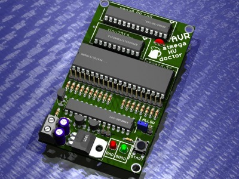</a>Just put your dead mega in socket, press the <strong>START</strong> button, and enjoy your good-as-new processor. There are three slots on board, for most common AVR’s, pins compatible with: <strong>Atmega8</strong>, <strong>Atmega16</strong>, <strong>Attiny2313</strong>. There is also an extra goldpin connector with all signals so you can attach adapters: 
“<strong>#1 adapter</strong>” as HVPP extension, for 20pin Attiny26 compatible and 40pin Atmega8515 compatible processors. 
“<strong>HVSP adapter</strong>” for 8pin and 14pin HVSP processors. 
Or make your own adapters for other types of processors, in trough-hole or surface-mounted, you can use the breadboard for this – just connect signals to correct pins. How? Check your AVR datasheet, go to “memory programming” and then “parallel programming” – check the signal names, all signals are described under the DIP40 slot. In doctor memory there is a lot of free space so project may be developed all the time. One sided PCB with 55mm x 92mm dimensions. On top side you need to solder several jumpers, or, make this PCB as double sided – choose yourself. Resistors from R7 to R23 may be in 100ohm to 10K, but i suggest from 470ohm to 1K.

<a href="pics/pins-help.png">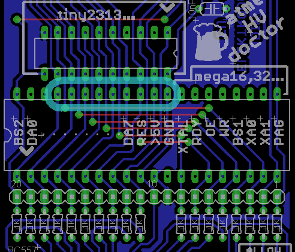</a> <strong>ATTENTION!</strong> While mounting the DIP40 slot, you must to remove it pins from 29 to 37. These pins must not have electrical contact with inserted uC pins, traces runs there only to make the board smaller (onesided). Take a look at pic on the left, these you must remove from slot.

<h3>Usage:</h3>

<a href="pics/fusebit_doctor_adapters_4.jpg">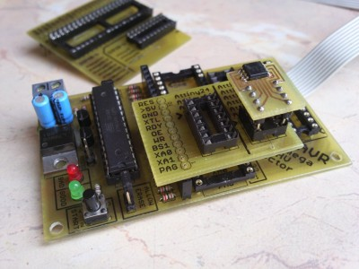</a>The <strong>ALLOW ERASE</strong> jumper allows doctor to erase whole flash and eeprom memory, if it is open, doctor will newer erase memory but may not cure device if lockbits are enabled, so you choose. After insert dead uC and press the <strong>START</strong> button, doctor will initiate the parallel or serial high-voltage programming mode. This is chosen automatically, device will recognize HVSP adapter and start to work in HVSP mode. After that, doctor wait for high state at RDY/BSY line. Then, read device signature and check if it supports it. Next, memory erase is performed if user allows that. Then lockbits are checked, and if they not blocking device, doctor sets all fusebits to fabric, having regard to whether there are extended fusebits or not. Some of older AVR have only one byte of fuses – LOW – and this is also included. After fusebits are verified, the proper leds is flashed.

<h3>Leds explanation:</h3>

<strong>green on</strong> – patient successfully cured, fusebits repaired. If lockbits are enabled, just verify fusebits with factory ones – and if they ok – light up green. 
<strong>red on</strong> – signature problem, can’t read, no device in socket, or no such signature in database. 
<strong><blink>green flashing</blink></strong> – signature ok, fusebits are wrong. Lockbits enabled, chip erase permission required (read below). 
<strong><blink>red flashing</blink></strong> – signature ok, no lockbits, but for some reason can’t write new fusebits.

<h3>Terminal:</h3>

Note that terminal is not needed, device works without pc, and all we want to know we get from leds. 
You can find extra RS232 output, and connecting this to the terminal, sends all information about fixing process – see exemplary printscreens in gallery. All the info is send “on fly” via uart. Use proper converter to connect this with pc. If you have COM port for RS232, use MAX232 based converter (eg <a href="https://web.archive.org/web/20180225102717/http://www.scienceprog.com/simple-ttl-to-rs232-adapter/" target="_blank" rel="nofollow"><strong>this</strong></a>). If you are using laptop, use the USB converter (like <a href="https://web.archive.org/web/20180225102717/http://mdiy.pl/konwerter-3w1-usb-do-rs232-rs485-uart/?lang=en" target="_blank" title="3in1 converter – USB to RS232, RS485, UART"><strong>this</strong></a> or <a href="https://web.archive.org/web/20180225102717/http://mdiy.pl/konwerter-usb-rs232/?lang=en" target="_blank" title="Simple USB – RS232 TTL converter" <="" a=""><strong>this</strong></a>).

Terminal settings: 
baudrate: 4800 
parity: none 
databits: 8 
stopbits: 1 
handshake: none

<h3>Other:</h3>

<a href="pics/prototype_doc.jpg">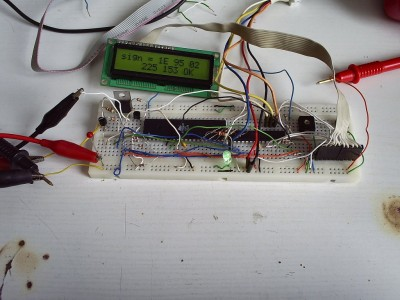</a>Use one of the following microcontrollers as the doctor-chip: Atmega8, Atmega88, Atmega88P, Atmega168, Atmega168P, Atmega328, Atmega328P – and their newer/low-voltage “A” or “L” versions. 
Use stabilized 12V supply voltage. Higher voltage can damage fixed chip!

Code was written based on high-voltage parallel and serial programming section of datasheet of suitable AVRs. 
If you are searching for <strong>attiny</strong> family AVR’s fusebits fix device, then check my previous project, the <a title="How to fix dead AVR Attiny fusebits" href="https://web.archive.org/web/20180225102717/http://mdiy.pl/attiny-fusebit-hvsp-doctor/#eng" target="_blank"><strong>Attiny fusebit doctor</strong></a>. Unfortunately, some bugs show off and this project is no longer updated since the “Atmega fusebit doctor” supports all the Attiny family AVRs. But, source code is attached for this project, and with avr datasheet, it will be easy to understand this programming mechanism. 

 
<h3>Fusebits:</h3>

Internal <strong>1MHz</strong> clock, and enabled EESAVE bit – see README file. 
If you use a brand new chips as doctor, you don’t need to change anything – 1MHz clock is already set as default. EESAVE bit is optional. It disallows to erase the eeprom when firmware is actualized, eeprom is used to store the fixed chips counter which is send trough uart.

<h3>UPDATE 2.1X ADDS NEW FUNCTIONALITY!</h3>

Send your own fuses and locks trough terminal, talk with chips with broken signature. If you connect terminal Tx pin to PCB Rx pin – manual mode will be enabled automatically. This requires Tx-terminal pin to be HIGH and OUTPUT when idle. It must pull up the 10K pulldown. If this condition is not met, doctor will work in normal – automatic mode.

<strong>HOWTO:</strong> 
First, doctor will read signature. And if fail, it will ask to type signature manually. 
Type two last bytes of signature in HEX (4 chars) and hit enter.

Then, doctor will try to read the chip depending on given signature. 
When succeed, select an option: 
    <strong>1</strong> – write fusebits – this will perform a fuse write cycle with fuse-values from buffer (default). 
    <strong>2</strong> – modify fusebits – this will let you to type fuses manually, values in buffer will update. Type one byte in HEX (2 chars) and hit enter. Repeat for each byte (if exist). 
    <strong>3</strong> – set lockbits – type new lock value in HEX (2 chars) and hit enter – do this with caution! Remember that unused bits are always 1! E.g. if want to enable LB1 and LB2, type FC (11111100) 
    <strong>4</strong> – erase the chip – this will just erase the chip and locks, it require “allow erase” jumper for safety. 
    <strong>5</strong> – end – exit programming and drop voltages, now you can safely remove the chip.

<a href="pics/fix_tiny13.png"><strong>See</strong></a> how Attiny13 with broken signature was repaired. 
<a href="pics/mess_tiny13.png"><strong>See</strong></a> how the same chip was “broken” again. 
Do not suggest LEDs when in manual mode – they just blinking randomly :) 
ATTENTION – Firmware 2.1x NEED a pcb updated to version 2h!

<h3>Gallery:</h3>

		
		
<dl class="gallery-item">
			<dt class="gallery-icon landscape">
				<a href="pics/prototype_doc.jpg">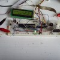</a>
			</dt></dl><dl class="gallery-item">
			<dt class="gallery-icon landscape">
				<a href="pics/mega_doctor_render.jpg">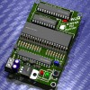</a>
			</dt></dl><dl class="gallery-item">
			<dt class="gallery-icon landscape">
				<a href="pics/mega_fusebit_doctor_4.jpg">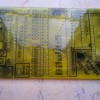</a>
			</dt></dl><dl class="gallery-item">
			<dt class="gallery-icon landscape">
				<a href="pics/mega_fusebit_doctor_5.jpg">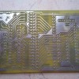</a>
			</dt></dl><dl class="gallery-item">
			<dt class="gallery-icon landscape">
				<a href="pics/mega_fusebit_doctor_3.jpg">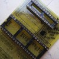</a>
			</dt></dl><dl class="gallery-item">
			<dt class="gallery-icon landscape">
				<a href="pics/mega_fusebit_doctor_1.jpg">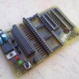</a>
			</dt></dl><dl class="gallery-item">
			<dt class="gallery-icon landscape">
				<a href="pics/mega_fusebit_doctor_2.jpg">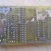</a>
			</dt></dl><dl class="gallery-item">
			<dt class="gallery-icon landscape">
				<a href="pics/fusebit_doctor_adapters_1.jpg">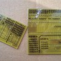</a>
			</dt></dl> <dl class="gallery-item">
			<dt class="gallery-icon landscape">
				<a href="pics/fusebit_doctor_adapters_2.jpg">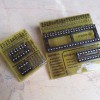</a>
			</dt></dl><dl class="gallery-item">
			<dt class="gallery-icon landscape">
				<a href="pics/fusebit_doctor_adapters_3.jpg">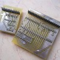</a>
			</dt></dl><dl class="gallery-item">
			<dt class="gallery-icon landscape">
				<a href="pics/fusebit_doctor_adapters_4.jpg">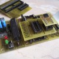</a>
			</dt></dl><dl class="gallery-item">
			<dt class="gallery-icon portrait">
				
			</dt></dl><dl class="gallery-item">
			<dt class="gallery-icon portrait">
				
			</dt></dl><dl class="gallery-item">
			<dt class="gallery-icon landscape">
				<a href="pics/pins-help.png">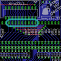</a>
			</dt></dl>
			 
		

<iframe src="https://www.youtube.com/watch?v=Hfc4Ngo1CO4" allowfullscreen="" width="800" height="600" frameborder="0"></iframe>

<h3>FAQ – frequently asked <strong>Q</strong>uestions and <strong>A</strong>nswers: (update 2014-02-01)</h3>

<strong>Q:</strong> No sign of life, no leds are working. 
<strong>A:</strong> Critical bugs on pcb, poorly programmed chip.

<strong>Q:</strong> Red led is on. 
<strong>A:</strong> Chip si not recognized. Make a voltage measurements. In idle, measure voltages on +12 RESET and +5 SUPPLY at female goldpin connector – you should get 0V or close to 0V on both. After the START button is pressed, you should get close to +12V and 5V for one second. If not, check transistors, if they are ok and if they are soldered ok.

<strong>Q:</strong> Red led is on. 
<strong>A:</strong> Bugs on pcb, traces are packed densely and its very possible that you have invisible gap, shortcut, or dry joint. Check everything with multimeter, but PRECISELY.

<strong>Q:</strong> Red led is on. 
<strong>A:</strong> Connect device to the terminal to get repair log. Press start to receive infos.

<strong>Q:</strong> Received “Init programming…” and nothing more – OR – received signature is “00 01 02” or “FF FF FF”. 
<strong>A:</strong> Chip is broken, or there still are bugs on pcb – look above.

<strong>Q:</strong> Received signature is “1E 90 00″, ” 1E 1E 1E”, or something familiar (meaningful data). 
<strong>A:</strong> Chip is good, it initiates, look for shortcuts on DATA, BS, XA lines.

<strong>Q:</strong> Green led is on / “Verifying… – OK!” received, but chips don’t work with standard programmer. 
<strong>A:</strong> You can be 100% sure that fuses are fixes, chip have hardware ISP damaged or it have some other damage.

<strong>Q:</strong> What are “Read Signature… FAIL!” and “Trying T2313 pinout… OK” doing in log? 
<strong>A:</strong> Alle the 20pin chips need to be threated individually. First, device tries to read chip with standard schematic, and if it fails (“FAIL!”), then it tries to use schematic for 20pin T2313 compatible chips and then chip is read properly. This is normal behavior, this not a bug.

<strong>Q:</strong> What are “&lt;[2J" trashes doing in log?
<strong>A:</strong> This is a terminal clear screen sequence, turn on the “VT-100” emulation in terminal settings.

<strong>Q:</strong> I’m trying to type data into terminal but no chars appearing. 
<strong>A:</strong>Make sure you set handshake to NONE in terminal settings.

<strong>Q:</strong> After typing data into the terminal, i can’t confirm them with return key and can’t type next ones. 
<strong>A:</strong> When pressing return, your terminal must have to send the CRLF chars, if not, check your settings.

<strong>Q:</strong> This still doesn’t help me, i tried everything but still have the problem. 
<strong>A:</strong> Ask in comments below :) Post firmware version and pcb version with which you try to work, paste the repair log.

<strong>Q:</strong> Do all these 1K series resistors (R7 up to R23) are really needed here? 
<strong>A:</strong> No, you can build the circuit without them. But remember, if for some reason out patient will not enter in the programming mode and continue with its code, then logic state conflict will occur between two microcontrollers which can damage them permanently. These resistors are to protect the circuit against such situations. I strongly recommend to build it exactly as schematic says.

<strong>Q:</strong> Pulldown resistors for 12V and 5V lines (R24 and R27) are heating up quite strongly in manual mode, and whole circuit takes more power, can i change them for something higher value? 
<strong>A:</strong> Yes, but circuit can work incorrectly with some of the patients. When idle, voltages should be near 0V, and when powering on or off, their edges should have proper steepness to provide good timing (see entering high voltage programming in datasheet). Because only simple bipolar transistors are used, these resistor guarantee above requirements. The interesting case is an attiny2313 problem when all the fuses were correctly burned, without one, the RSTDISBL. As it showed up, because of bad edges of 12V reset voltage, this uC although was working in parallel mode, but not in high voltage, so it was not allowing to change that fuse – this is my own interpretation so i can be wrong.

<strong>Q:</strong> My chip is read properly but doctor can not write new fuses, allow erase is enabled. 
<strong>A:</strong> If the ISP programmer acts the same way, then your chip is damaged, nothing can do.

<strong>Q:</strong> Without a patient, circuit acts awkward, it freezes, and goes on when i put my finger near the traces. 
<strong>A:</strong> This circuit is not meant to be used without a patient. It acts in such way because when entering in programming mode, it is waiting for a high state on the RDY pin from patient. This pin is not pulled down and works as high impedance input, so electrostatic charge from your finger is read as high state and code goes on further.

<strong>Q:</strong> Chip names are not appearing in the log, i see “no names in 8kB ver” instead. 
<strong>A:</strong> Chip names are not displayed in 8kB versions of the firmware, i.e. for atmega8 and atmega88 – because names  don’t fit in such memory space. If you want the names, use atmega168 or atmega328 chip and burn proper firmware.

<strong>ALWAYS use the newest version of the firmware.</strong> Hex and bin files are the flash memory files, use one of them. No need to program eeprom memory.

  

